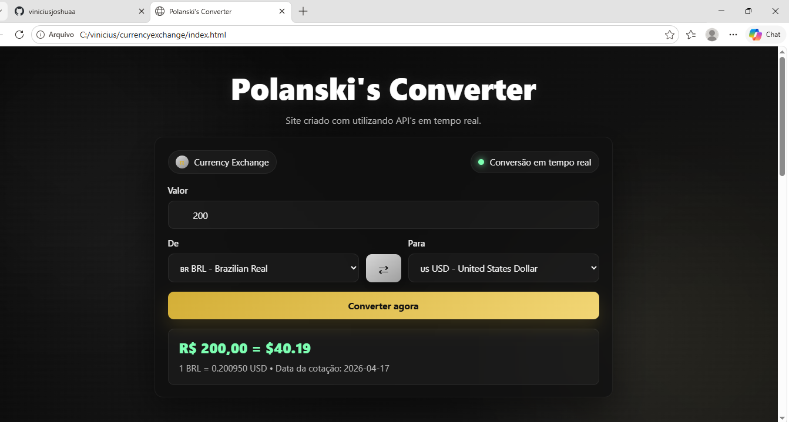
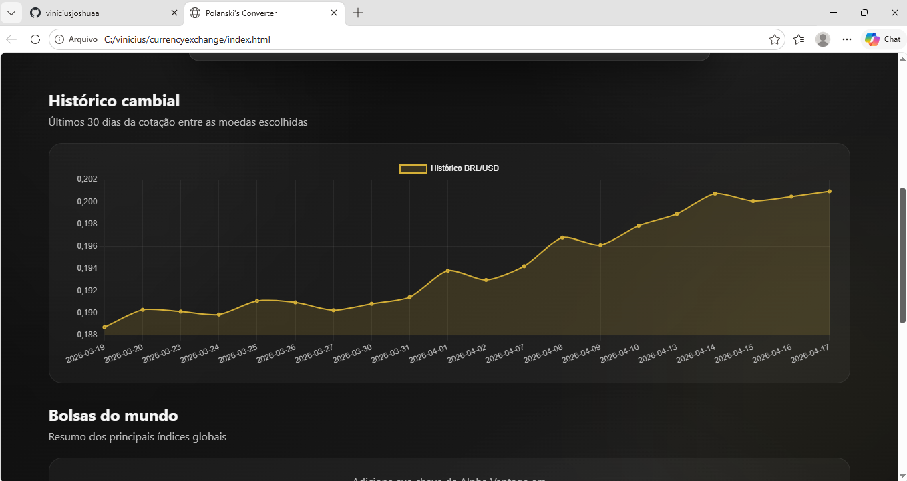

# Polanski's Converter

Projeto pessoal criado para praticar integração com APIs em tempo real, JavaScript, HTML e CSS, além de explorar criação visual por meio da animação das moedas exibidas na tela.

## O que o projeto faz

- Conversão de moedas em tempo real
- Histórico cambial dos últimos 30 dias
- Painel com índices de mercado
- Gráfico comparativo dos índices carregados
- Animação visual de moedas gerada com JavaScript
- Layout responsivo em uma única página

## Tecnologias utilizadas

- HTML5
- CSS3
- JavaScript
- Frankfurter API para câmbio
- Alpha Vantage para dados de mercado
- Chart.js

## Como rodar localmente

Como o projeto é estático, você pode abrir o `index.html` no navegador. Para evitar bloqueios de segurança em alguns navegadores, o ideal é usar um servidor local simples.

### Opção 1: VS Code com Live Server

- Abra a pasta do projeto no VS Code
- Instale a extensão **Live Server**
- Clique com o botão direito em `index.html`
- Escolha **Open with Live Server**

### Opção 2: Python

```bash
python -m http.server 5500
```

Depois acesse:

```text
http://localhost:5500
```

## Modo de demonstração

Caso você queira testar a interface sem depender das APIs, ative o modo demo no `config.js`:

```js
window.APP_CONFIG = {
  ALPHA_VANTAGE_KEY: "COLOQUE_SUA_CHAVE_AQUI",
  DEMO_MODE: true
};
```

Também é possível abrir manualmente com o parâmetro abaixo:

```text
index.html?demo=1
```

## Funcionalidades testadas

- Conversão BRL → USD
- Inversão de moedas
- Renderização do gráfico cambial
- Exibição dos índices de mercado
- Renderização do gráfico comparativo dos índices
- Exibição das animações de moedas em tela

## Screenshots

### Conversão de moedas




### Gráfico comparativo



## Estrutura principal

```text
polanski-coverter/
├── index.html
├── style.css
├── script.js
├── config.js
├── config.example.js
└── screenshots/
```

## Melhorias aplicadas nesta versão

- Organização da chave da API em arquivo separado
- Ajuste na seção da bolsa para reduzir risco de estouro de limite
- Cache local temporário para os dados de mercado
- Modo de demonstração para testes e apresentação
- README reescrito com instruções de uso
- Screenshots reais adicionados ao projeto

## Licença

Uso pessoal e educacional.
